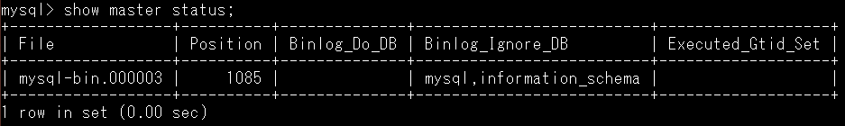
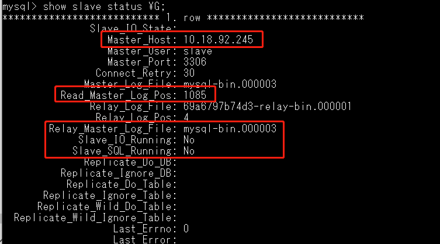
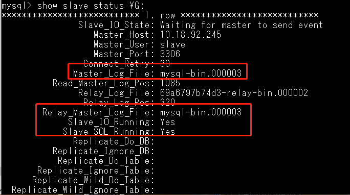

# Docker 安装Mysql

## 1. Mysql 单节点部署
### 1.1. 创建挂载目录
```text
sudo mkdir -p /root/mysql
sudo mkdir -p /root/mysql/data
sudo mkdir -p /root/mysql/logs
sudo mkdir -p /root/mysql/conf
```
### 1.2. 创建 mysql 配置文件 /root/mysql/conf/my.cnf
```text
[mysqld]
skip-ssl
default-time-zone = '+8:00'
max_connections = 1024
server_id = 1
log-bin = mysql-bin
binlog-ignore-db = mysql
binlog-ignore-db = information_schema
```
### 1.3. 启动Mysql 
```text
docker run -p 3306:3306 --name mysql5.7 -v /root/mysql/conf:/etc/mysql/conf.d -v /root/mysql/logs:/logs -v /root/mysql/data:/var/lib/mysql -e MYSQL_ROOT_PASSWORD=loccs -d mysql:5.7
```

## 2. Mysql 主从部署
### 2.1. 部署Mysql 主服务
```text
    参考 "Mysql 单节点部署"
```

### 2.2. 部署Mysql 从服务
```text
参照 "Mysql 单服务部署"

注：
   在编写 /root/mysql/conf/my.cnf 配置文件时，配置文件中的 server_id 不能和主服务相同

修改过配置文件，重启生效
```

### 2.3. 主服务创建同步账户
```text
# 进入 mysql 容器内部
docker exec -it xxxxx /bin/bash 

# 登录 mysql 客户端
mysql -uroot -p


# 创建用户
CREATE USER 'slave'@'%' IDENTIFIED BY 'MySQL_password';

# 为用户授权
GRANT REPLICATION SLAVE, REPLICATION CLIENT ON *.* TO 'slave'@'%';

# 刷新权限列表
FLUSH PRIVILEGES;
```

### 2.4. 查看Master 状态
```text
# 保持在Mysql 客户端内， 输入
show master status;

输出如下：（记录 File 和 Position 字段的值，后续要用）
```


### 2.5. 登录从服务，进行配置
```text
# 进入 mysql 容器内部
docker exec -it xxxxx /bin/bash 

# 登录 mysql 客户端
mysql -uroot -p

# 关闭slave 
stop slave

# 在从服务中修改 master 的同步信息
change master to master_host='192.168.1.15', master_user='slave', master_password='MySQL_password', master_port=3306, master_log_file='mysql-bin.000003', master_log_pos=1085, master_connect_retry=30;

# 查看 从服务中的 slave 信息，观察 master 相关配置， 如下图所示：（图中框出部分为master 相关配置信息，其中Running 项为 NO， 因为 slave 未启动）
show slave status \G;
```

```text
# 启动从服务的 slave 
start slave

# 再次查看 slave 状态
```


### 2.6. 测试主从同步是否正常
```text
在主库中 创建一个数据库， 查看从库是否同步
```
### 2.7. 主从切换操作
```text
旧主：
   flush tables with read lock;

旧从：
   stop slave;
   flush tables with read lock;
   reset slave;

旧主：reset master;


旧从：show master status;  记录：File 和 position


旧主：
		change master to master_host='192.168.1.15', master_user='slave', master_password='MysqlSc1', master_port=3306, master_log_file='master-bin.000001', master_log_pos=775, master_connect_retry=30;
    start slave;


旧从： unlock tables;
旧主： unlock tables;


如果旧从库数据大于旧主库，则需要进行数据同步：

旧从：mysqldump -uroot -p -A --master-data=2 >/var/lib/mysql/mysql_all.sql

拷贝 mysql_all.sql 到新的从库；

进入mysql 执行：
 source mysql_all.sql;
```